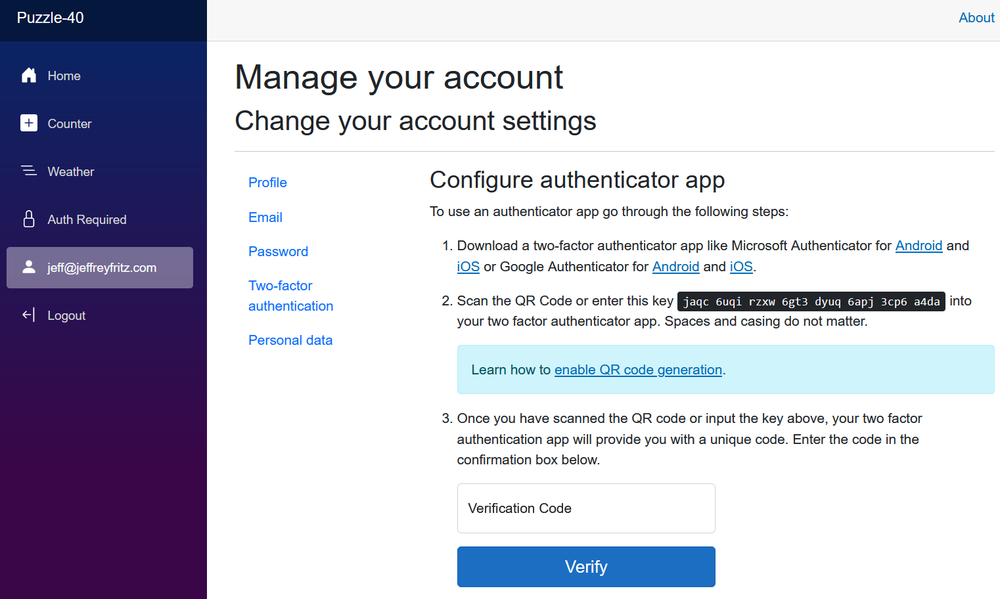

# Puzzle-40
Let's set up authentication for our Blazor application... and then turn on two factor authentication.  How do I get that QR code to work?

There's [instructions on Microsoft Learn that are referred to in the Blazor template](https://learn.microsoft.com/en-us/aspnet/core/security/authentication/identity-enable-qrcodes?view=aspnetcore-8.0), but they don't seem to work.

We've added the [QR Code script file](Puzzle-40/wwwroot/qrcode.min.js) and linked it in [App.razor](Puzzle-40/Components/App.razor) and written the code into the [EnableAuthenticator](Puzzle-40/Components/Account/Manage/EnableAuthenticator) page.

How do we finish configuring the QR Code generation for this page?